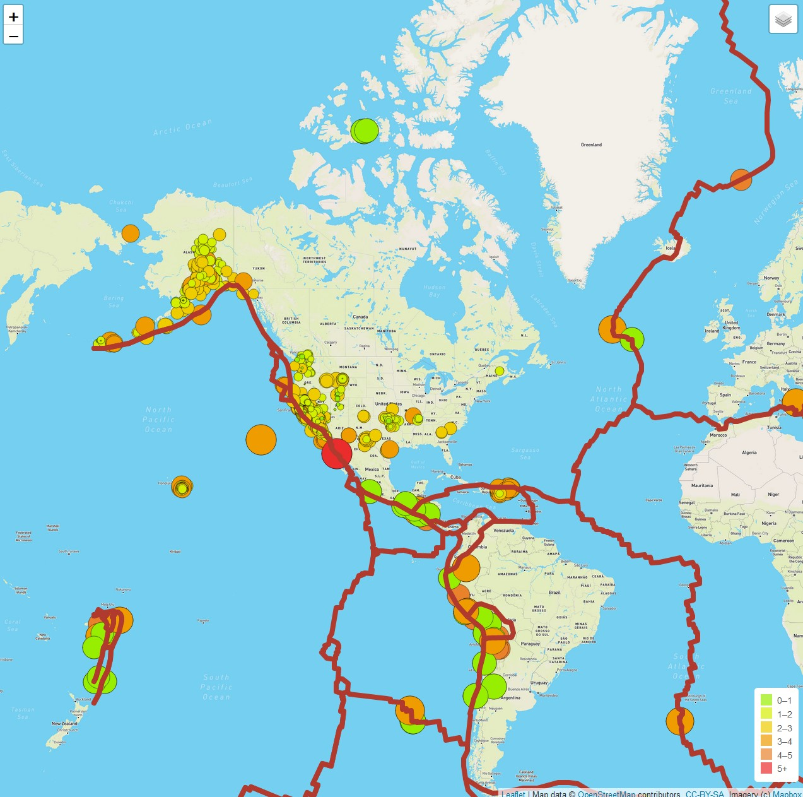
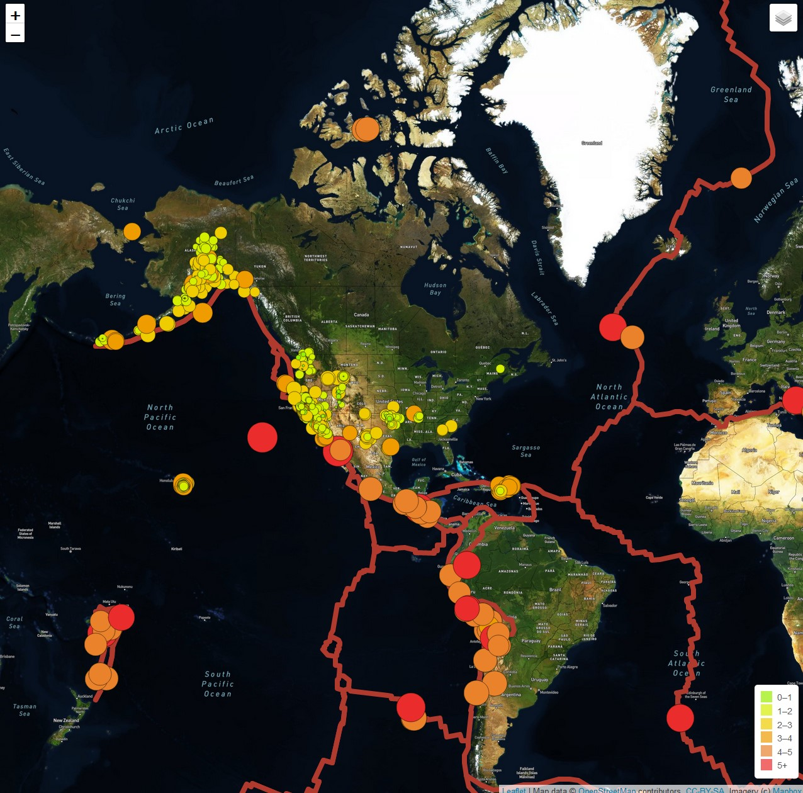
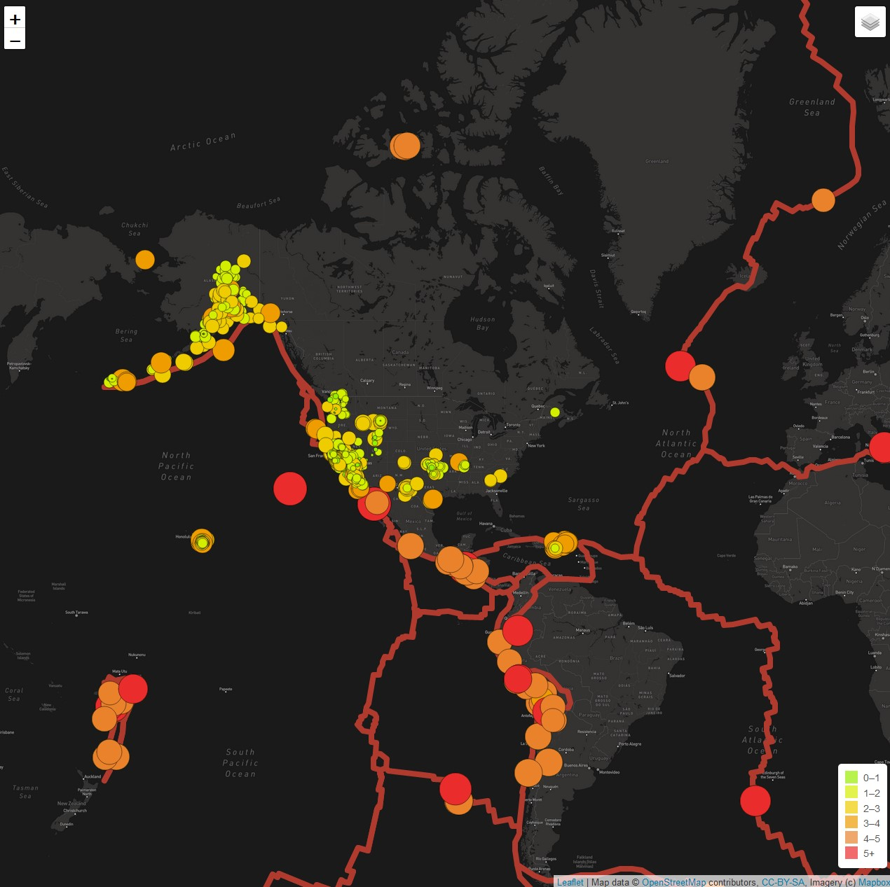
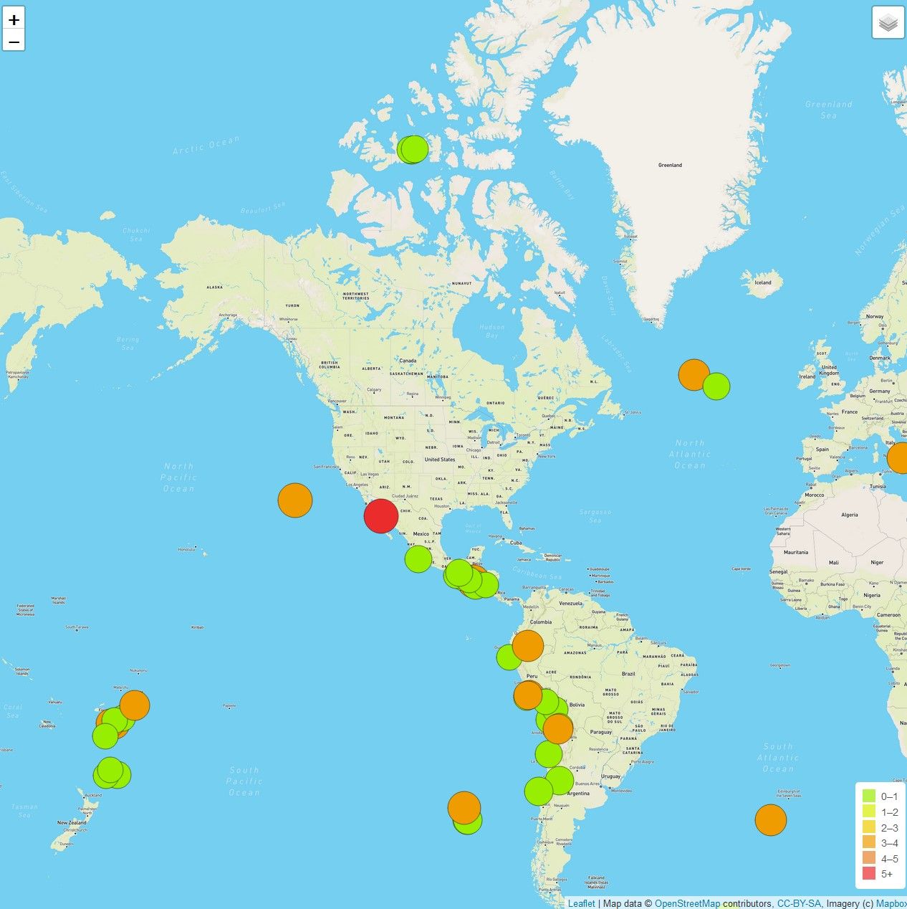

# Mapping_Earthquakes

## Purpose:
The purpose of this project was to create a map using the mapbox API that will display recent worldwide earthquake information using various map layers.  The project also incorporated tectonic plate markers and features a filter that only shows major earthquakes.  See the below images.

### Completed Project:

### Satellite View:

### Dark View:

### Major Earthquakes Only:

